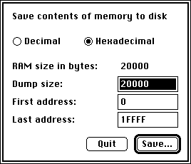

<!--
SPDX-FileCopyrightText: © 2025 Ryan Carsten Schmidt <https://github.com/ryandesign>
SPDX-License-Identifier: MIT
-->

# memdump

**memdump** is a program for Macintosh computers to let you save the contents of memory to a file.

## Compatibility

**memdump** is intended to be compatible with any Macintosh with a 680x0 processor.

## Download

Get a compiled version of **memdump** that's ready to run by downloading
memdump.bin from [the latest release on the Releases
page](https://github.com/ryandesign/memdump/releases/latest). It's encoded in
MacBinary format. Use a program like [StuffIt
Expander](https://www.gryphel.com/c/sw/archive/stuffexp/) or
[binUnpk](https://www.gryphel.com/c/minivmac/extras/binunpk/) to decode it.

## Source code

**memdump** was created using THINK C 4 and ResEdit.

Like other Macintosh programs, THINK C writes text files that use MacRoman
encoding and carriage return line endings, but in git repositories text files
are stored with UTF-8 encoding and linefeed line endings. And resource files
like the THINK C project file and files created by ResEdit can't be represented
in git repositories or on non-Mac filesystems, therefore in this repository
resource files have been converted to rez format.

If you wish to compile the code yourself, the `./export.sh` script will perform
all the necessary conversions and place the converted files on a new or existing
floppy disk image that can be loaded into an emulator like [Mini
vMac](https://www.gryphel.com/c/minivmac/). The compiled program and any changes
you make can be brought back from the disk image using the `./import.sh` script.

These scripts work only on macOS because they rely on programs that come with
macOS, like `macbinary` and `Rez`, and the fact that macOS filesystems can still
represent resource files. They also require
[hfsutils](https://ports.macports.org/port/hfsutils).

## License

MIT
